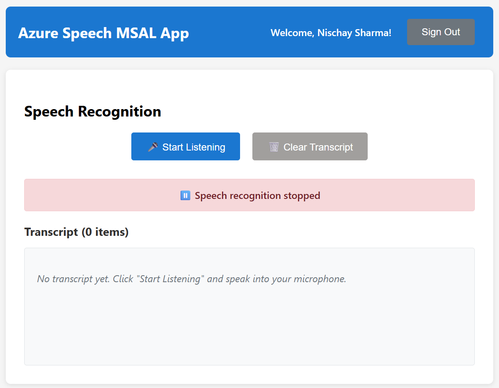

# Azure Speech with MSAL React App

A React application that integrates Azure Speech Service with Microsoft Authentication Library (MSAL) for secure user authentication using Azure AD token-based authentication.

## 📚 Documentation

This README provides step-by-step implementation instructions. For detailed conceptual explanations of why each configuration step is necessary and how the authentication flow works, see [Speech-MSAL-Conceptual-Guide.md](Speech-MSAL-Conceptual-Guide.md).

## 📸 Application Preview

| Login                             | Interface                    | In Action                                    |
| --------------------------------- | ---------------------------- | -------------------------------------------- |
|  |        |       |
| _Azure AD authentication_         | _Main application interface_ | _Live transcription with network inspection_ |

## Features

- **MSAL Authentication**: Secure user login using Microsoft Azure Active Directory
- **Token-based Speech Authentication**: Azure Speech Service authentication using Azure AD tokens (no subscription keys required)
- **Azure Speech Service**: Real-time speech-to-text transcription using microphone
- **Protected Routes**: Speech functionality only available to authenticated users
- **Real-time Transcription**: Live speech recognition with continuous listening
- **Modern React**: Built with React 18 and functional components with hooks

## Prerequisites

Before you begin, you'll need:

- An Azure subscription with permissions to create resources
- Node.js 18+ installed (if not using dev container)
- Basic understanding of React and Azure AD concepts

## Azure Configuration Steps

Follow these steps in order to properly configure Azure resources for MSAL authentication with Speech Service. These steps align with the detailed conceptual guide in `Speech-MSAL-Conceptual-Guide.md`.

### Step 1: Configure the Speech Resource for Microsoft Entra Authentication

#### 1.1 Create the Speech Service

1. Go to Azure Portal > Create a resource > Speech
2. Configure the Speech Service:
   - **Subscription**: Your Azure subscription
   - **Resource Group**: Create new or use existing
   - **Region**: Choose a region close to your users (note this for later)
   - **Name**: Choose a unique name for your Speech Service
   - **Pricing Tier**: S0 for production, F0 for development/testing
3. Click "Review + create" and then "Create"
4. After deployment, navigate to your Speech Service resource
5. Go to "Properties" and note down the **Resource ID** (format: `/subscriptions/{subscription-id}/resourceGroups/{resource-group}/providers/Microsoft.CognitiveServices/accounts/{account-name}`)

#### 1.2 Create a Custom Domain Name

⚠️ **Critical Step**: Default Speech Service endpoints cannot be used with Azure AD tokens. You must configure a custom domain.

1. In your Speech Service resource, go to "Networking" in the left navigation
2. Click on "Custom domain" tab
3. Click "Create custom domain"
4. Enter a unique subdomain name (e.g., `my-speech-app-2025`)
5. Click "Save" and wait for the configuration to complete
6. Note the full custom domain URL (e.g., `https://my-speech-app-2025.cognitiveservices.azure.com`)

**Important**: This custom domain cannot be changed once set and will be used as your Speech Service endpoint.

#### 1.3 Assign the Cognitive Services Speech User Role

1. In your Speech Service resource, go to "Access control (IAM)"
2. Click "Add" > "Add role assignment"
3. Select **Role**: "Cognitive Services Speech User"
4. Select **Assign access to**: User, group, or service principal
5. Search for and select the users/groups who will use your application
6. Click "Review + assign"

### Step 2: Register Your Client Application

1. Go to Azure Portal > Azure Active Directory > App registrations
2. Click "New registration"
3. Configure your React app registration:
   - **Name**: Your app name (e.g., "Azure Speech MSAL App")
   - **Supported account types**: Choose based on your needs:
     - "Accounts in this organizational directory only" (single tenant) - recommended for internal apps
     - "Accounts in any organizational directory" (multi-tenant) - for apps used by multiple organizations
   - **Redirect URI**: 
     - Platform: "Single-page application (SPA)"
     - URI: `http://localhost:3000` (for development)
4. Click "Register"
5. After creation, note down:
   - **Application (client) ID**
   - **Directory (tenant) ID**

### Step 3: Register an Application to Expose the Speech Service API

#### 3.1 Create the Speech Service API App Registration

1. Go to Azure Portal > Azure Active Directory > App registrations
2. Click "New registration"
3. Configure the API app registration:
   - **Name**: Something descriptive like "Speech Service API" or "{YourAppName}-SpeechAPI"
   - **Supported account types**: Same as your client app
   - **Redirect URI**: Leave blank (not needed for API registrations)
4. Click "Register"
5. Note down the **Application (client) ID** for this API app registration

#### 3.2 Set the Application ID URI

1. In the Speech Service API app registration, click "Expose an API" in the left navigation
2. Click "Add" next to "Application ID URI" (or "Set" if it's the first time)
3. **Important**: Enter your Speech Service custom domain URL exactly as configured in Step 1.2:
   - Example: `https://my-speech-app-2025.cognitiveservices.azure.com`
4. Click "Save"

#### 3.3 Define the user_impersonation Scope

1. Still in "Expose an API", click "Add a scope"
2. Configure the scope:
   - **Scope name**: `user_impersonation`
   - **Who can consent**: "Admins and users"
   - **Admin consent display name**: "Access Speech Service on behalf of user"
   - **Admin consent description**: "Allow the application to access Speech Service on behalf of the signed-in user"
   - **User consent display name**: "Access Speech Service on your behalf"
   - **User consent description**: "Allow the app to access Speech Service on your behalf"
   - **State**: Enabled
3. Click "Add scope"

#### 3.4 Authorize the Client Application

1. Still in "Expose an API", scroll down to "Authorized client applications"
2. Click "Add a client application"
3. Enter the **Client Application ID** from Step 2 (your React app's client ID)
4. Check the box next to the `user_impersonation` scope
5. Click "Add application"

### Step 4: Configure API Permissions for Your Client Application

1. Go back to your **client app registration** (from Step 2)
2. Click "API permissions" in the left navigation
3. Click "Add a permission"

#### 4.1 Add Speech Service API Permission

1. Click "APIs my organization uses" tab
2. Search for the Speech Service API app you created in Step 3
3. Click on it from the search results
4. Click "Delegated permissions"
5. Check "user_impersonation"
6. Click "Add permissions"

#### 4.2 Add Microsoft Graph Permissions (if needed)

The default permissions usually include the necessary Graph permissions, but verify these are present:
- `openid` - Sign users in
- `profile` - View users' basic profile
- `User.Read` - Sign in and read user profile (optional)

#### 4.3 Grant Admin Consent

1. Click "Grant admin consent for {your-tenant-name}"
2. Click "Yes" in the confirmation dialog
3. Verify all permissions show "Granted for {tenant-name}" in green

### Step 5: Azure AD App Registration Summary

After completing the above steps, you should have:

1. **Speech Service Resource** with:
   - Custom domain configured
   - "Cognitive Services Speech User" role assigned to users

2. **Client App Registration** with:
   - SPA redirect URI configured
   - API permissions for your Speech Service API
   - Admin consent granted

3. **Speech Service API App Registration** with:
   - Application ID URI set to your custom domain
   - `user_impersonation` scope defined
   - Client application authorized

## Quick Start

1. **Complete Azure Configuration**: Follow the detailed steps in the [Azure Configuration Steps](#azure-configuration-steps) section
2. **Set up Development Environment**: Choose Option 1 (Dev Container) or Option 2 (Local Development) 
3. **Configure Environment Variables**: Create `.env.local` with your Azure settings
4. **Install Dependencies**: Run `npm install` (or automatic in dev container)
5. **Start the App**: Run `npm start`
6. **Test Authentication**: Sign in and test speech recognition

⚠️ **Important**: You must complete all Azure configuration steps before the app will work. The Speech Service requires specific Azure AD setup that cannot be skipped.

## Setup

### Option 1: Development Container (Recommended)

This project includes a complete development container setup for a consistent development environment with all dependencies pre-installed.

**Prerequisites:**

- Docker Desktop
- VS Code with Dev Containers extension

**Steps:**

1. Clone the repository
2. Open the project in VS Code
3. Click "Reopen in Container" when prompted (or use Command Palette > "Dev Containers: Reopen in Container")
4. Wait for the container to build and dependencies to install automatically
5. Copy `.env.example` to `.env.local` and configure your Azure settings
6. The development server will be ready to start with `npm start`

**Dev Container Features:**

- Node.js 20 with npm and eslint pre-installed
- GitHub CLI for repository management
- Automatic dependency installation via postCreateCommand
- Port forwarding for development server (3000, 3001)
- VS Code extensions for React, Azure, and development tools

### Option 2: Local Development

1. Ensure you have Node.js 18+ installed
2. Install dependencies:

   ```bash
   npm install
   ```

3. Create environment configuration (see Configuration section below)

4. Start the development server:
   ```bash
   npm start
   ```

## Configuration

### Environment Variables

After completing the Azure configuration steps above, create a `.env.local` file in the root directory with your Azure configuration:

```env
# Azure AD Configuration
REACT_APP_AZURE_CLIENT_ID=your-client-app-id-from-step-2
REACT_APP_AZURE_AUTHORITY=https://login.microsoftonline.com/your-tenant-id-from-step-2

# Azure Speech Service Configuration
REACT_APP_SPEECH_URL=your-custom-domain-from-step-1.2
REACT_APP_SPEECH_REGION=your-speech-service-region-from-step-1.1
REACT_APP_SPEECH_RESOURCE_ID=your-speech-resource-id-from-step-1.1
```

**Example configuration:**
```env
# Azure AD Configuration
REACT_APP_AZURE_CLIENT_ID=12345678-1234-1234-1234-123456789012
REACT_APP_AZURE_AUTHORITY=https://login.microsoftonline.com/87654321-4321-4321-4321-210987654321

# Azure Speech Service Configuration
REACT_APP_SPEECH_URL=https://my-speech-app-2025.cognitiveservices.azure.com
REACT_APP_SPEECH_REGION=eastus
REACT_APP_SPEECH_RESOURCE_ID=/subscriptions/12345678-1234-1234-1234-123456789012/resourceGroups/my-rg/providers/Microsoft.CognitiveServices/accounts/my-speech-service
```

**Where to find these values:**

- **REACT_APP_AZURE_CLIENT_ID**: From Step 2 - Client app registration overview page
- **REACT_APP_AZURE_AUTHORITY**: Use your tenant ID from Step 2 in the URL format shown
- **REACT_APP_SPEECH_URL**: Your custom domain from Step 1.2 (must include `https://`)
- **REACT_APP_SPEECH_REGION**: The region you selected when creating the Speech Service in Step 1.1
- **REACT_APP_SPEECH_RESOURCE_ID**: The full resource ID from Step 1.1 (Properties page of your Speech Service)

### Important Notes

- The `.env.local` file should never be committed to version control
- Restart your development server after changing environment variables
- The Speech URL must be your custom domain (not the default regional endpoint)
- The Speech Resource ID must be the complete Azure resource identifier

### Verification

To verify your configuration is correct:

1. All environment variables should be present in `.env.local`
2. The Speech URL should resolve to your Speech Service (you can test in a browser)
3. The client ID should match your app registration in Azure AD
4. The tenant ID should be correct for your Azure AD tenant

## Project Structure

```
azure-speech-msal/
├── .devcontainer/
│   └── devcontainer.json          # Dev container configuration
├── public/
│   └── index.html                 # HTML template
├── src/
│   ├── components/
│   │   ├── SignInButton.js        # Azure AD sign-in component
│   │   ├── SignOutButton.js       # Azure AD sign-out component
│   │   └── SpeechRecognition.js   # Main speech recognition component
│   ├── App.js                     # Main application component
│   ├── config.js                  # MSAL and Speech Service configuration
│   ├── index.css                  # Application styles
│   └── index.js                   # Application entry point
├── .env.example                   # Environment variables template
├── .gitignore                     # Git ignore rules
├── package.json                   # Dependencies and scripts
└── README.md                      # This file
```

## Usage

1. **Start the application**:

   ```bash
   npm start
   ```

2. **Sign In**: Click "Sign In" to authenticate with Microsoft Azure AD

   
   _Azure AD authentication login page_

3. **Start Speech Recognition**: Once authenticated, click "🎤 Start Listening" to begin speech recognition

   
   _Main application interface with authentication completed_

4. **Speak**: Speak into your microphone to see real-time transcription appear

5. **View Transcript**: See all recognized speech with timestamps

6. **Stop/Clear**: Use "⏹️ Stop Listening" to end the session or "🗑️ Clear Transcript" to clear results

### Application in Action


_Application actively transcribing speech with network inspector showing Azure AD token acquisition and WebSocket connection to Speech Service_

The screenshot above demonstrates:

- **Real-time transcription** of spoken words appearing in the transcript area
- **Network calls** visible in browser developer tools showing:
  - Azure AD token acquisition requests
  - WebSocket connection establishment to Azure Speech Service
  - Secure token-based authentication flow

## Security Features

- **Token-based Authentication**: Uses Azure AD tokens instead of subscription keys for enhanced security
- **Silent Token Refresh**: Automatic token renewal without user intervention
- **Protected Speech Access**: Speech functionality only available to authenticated users
- **Secure Token Handling**: Proper token storage and management with MSAL
- **HTTPS Ready**: Configured for secure production deployment

## Technical Details

### Authentication Flow

The application implements a secure token-based authentication flow:

1. **User Authentication**: User signs into the React app using Azure AD via MSAL
2. **Token Request**: App requests an access token specifically for the Speech Service resource
3. **Token Validation**: Speech Service validates the Azure AD token and authorizes access
4. **API Access**: App can now securely call Speech Service APIs using the token

### Key Security Features

- **No API Keys**: Uses Azure AD tokens instead of subscription keys for enhanced security
- **User-level Authorization**: Each user must have the "Cognitive Services Speech User" role
- **Token Expiration**: Automatic token refresh handles expiration transparently
- **Audience Validation**: Tokens are issued specifically for your Speech Service resource

### Speech SDK Integration

The Speech SDK is configured with:
- **Authorization Token**: Formatted as `aad#{resourceId}#{accessToken}`
- **Custom Endpoint**: Your Speech Service custom domain (required for Azure AD)
- **Region**: Must match your Speech Service resource region
- **Continuous Recognition**: Real-time speech-to-text processing

### Authentication Flow

1. User signs in with Azure AD via MSAL
2. Application acquires access token for Speech Service scope
3. Token is used to create Azure AD authentication token for Speech SDK
4. Speech Service validates the token and grants access

### Speech Recognition

- Uses Microsoft Cognitive Services Speech SDK
- Implements continuous recognition for real-time transcription
- Handles microphone permissions and audio input
- Provides real-time feedback and error handling

## Troubleshooting

### Common Configuration Issues

1. **Custom Domain Not Configured**:
   - **Error**: Authentication fails with default Speech Service endpoint
   - **Solution**: Ensure you've configured a custom domain in Step 1.2. Default endpoints (like `eastus.api.cognitive.microsoft.com`) cannot be used with Azure AD tokens.

2. **Application ID URI Mismatch**:
   - **Error**: Token audience validation failures
   - **Solution**: Verify the Application ID URI in Step 3.2 exactly matches your Speech Service custom domain URL (including `https://`)

3. **Missing Role Assignment**:
   - **Error**: 403 Forbidden errors when calling Speech Service
   - **Solution**: Ensure users have the "Cognitive Services Speech User" role assigned to the Speech Service resource (Step 1.3)

4. **Client App Not Authorized**:
   - **Error**: Consent required errors or permission denied
   - **Solution**: Verify your client app is listed in the authorized client applications (Step 3.4) and admin consent is granted (Step 4.3)

5. **Incorrect Environment Variables**:
   - **Error**: Configuration or connection errors
   - **Solution**: Double-check all environment variables match the values from your Azure configuration:
     - `REACT_APP_SPEECH_URL` must be your custom domain (not the default endpoint)
     - `REACT_APP_SPEECH_RESOURCE_ID` must be the complete Azure resource identifier
     - `REACT_APP_AZURE_CLIENT_ID` must be from your client app registration (Step 2)

### Common Runtime Issues

1. **Permission Denied in Dev Container**:
   - The dev container automatically handles node_modules permissions
   - If issues persist, rebuild the container

2. **Speech Recognition Not Working**:
   - Ensure microphone permissions are granted in browser
   - Check browser console for Azure AD token acquisition errors
   - Verify Speech Service is accessible at your custom domain
   - Check that the Speech SDK is receiving valid Azure AD tokens

3. **Authentication Errors**:
   - Verify redirect URI matches exactly (`http://localhost:3000` for development)
   - Ensure your app registration is configured as a Single-Page Application (SPA)
   - Check that admin consent has been granted for all required permissions

4. **Token Acquisition Failures**:
   - **Silent acquisition fails**: This is normal - the app should fall back to interactive authentication
   - **Interactive acquisition fails**: Check Azure AD configuration and permissions
   - **Token audience errors**: Verify Application ID URI matches Speech Service custom domain

### Debugging Steps

1. **Check Browser Console**: Look for MSAL and network errors
2. **Verify Network Calls**: Use browser developer tools to inspect:
   - Azure AD token requests
   - Speech Service WebSocket connections
   - Token format and audience claims
3. **Test Custom Domain**: Ensure your Speech Service custom domain is accessible
4. **Validate Configuration**: Use the verification steps in the Configuration section

### Environment Variables Debugging
   - Ensure `.env.local` or `.env` file exists and has correct values
   - Restart development server after changing environment variables

### Development Commands

```bash
# Install dependencies
npm install

# Start development server
npm start

# Build for production
npm run build

# Run tests
npm test

# Lint code
npm run lint
```

## Contributing

1. Fork the repository
2. Create a feature branch
3. Make your changes
4. Test thoroughly
5. Submit a pull request

## License

This project is licensed under the MIT License - see the LICENSE file for details.

## Support

For issues and questions:

- Check the troubleshooting section above
- Review Azure Speech Service documentation
- Check MSAL React documentation
- Create an issue in the repository
